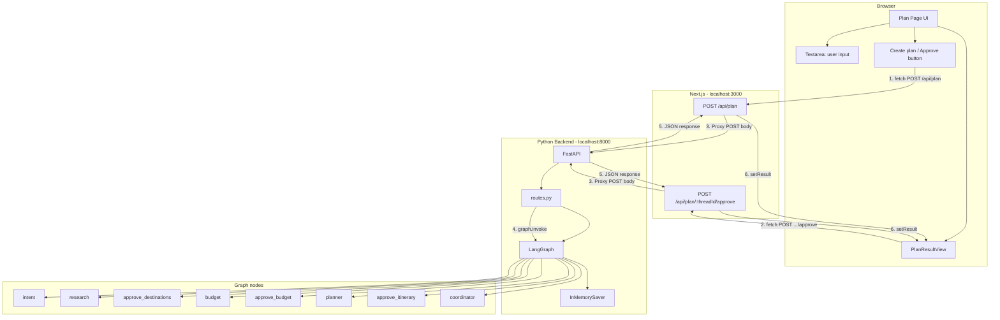
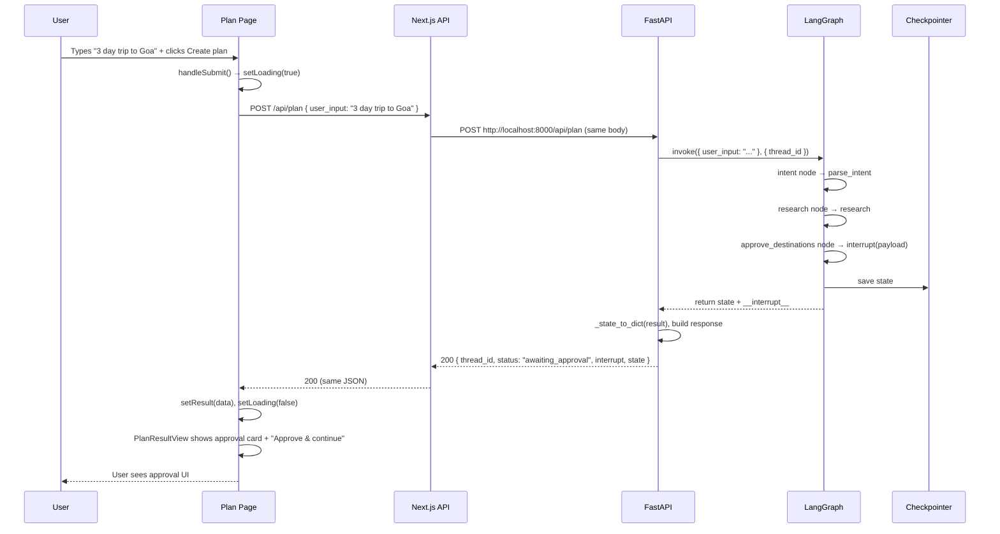
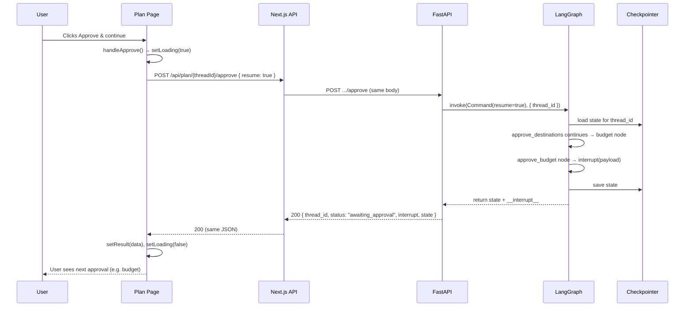
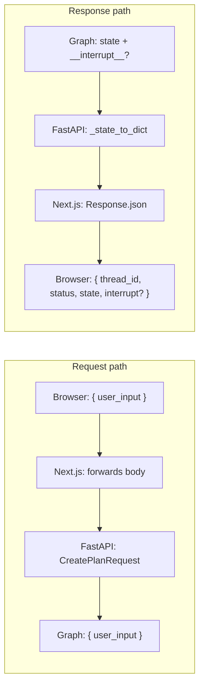

# Application Flow – UI Input to End Response

This document describes how a request flows through the system from the moment the user enters text and clicks **Create plan** until they see the final itinerary and booking options (or the next approval step). Diagrams show the infrastructure and the step-by-step path.

---

## 1. Infrastructure overview

All layers from the browser to the backend and back:

**Hop summary:**

| Step | From | To | What |
|------|------|-----|------|
| 1 | Browser | Next.js | `fetch(origin + "/api/plan", { body: { user_input } })` or `fetch(".../approve", { body: { resume } })` |
| 2 | Next.js API route | FastAPI | `fetch(BACKEND_URL + "/api/plan", { body })` (proxy) |
| 3 | FastAPI router | LangGraph | `graph.invoke(inputs, config)` or `graph.invoke(Command(resume), config)` |
| 4 | LangGraph | Nodes | Runs intent → research → approve_destinations → … (or continues from interrupt) |
| 5 | FastAPI | Next.js | `Response.json({ thread_id, status, state, interrupt? })` |
| 6 | Next.js | Browser | JSON response → React `setResult` → UI re-renders |

---

## 2. End-to-end sequence (first request to first interrupt)

From the user typing and submitting until the UI shows the first approval card:

---

## 3. Approve and continue (resume until next interrupt or done)

When the user clicks **Approve & continue**, the same thread is resumed. The graph continues from the interrupted node; it may hit another interrupt or run to completion.

This cycle repeats for **approve_budget** and **approve_itinerary**. When the graph reaches **coordinator** and then END, the response has `status: "complete"` and no `interrupt`; the UI then shows the full plan (PlanResultContent).

---

## 4. Full journey (all steps until final response)

A single “plan” goes through several round-trips. This diagram shows the full journey at a high level:

```mermaid
flowchart TB
  subgraph round1 [Round 1: Create plan]
    A1[User submits text]
    A2[POST /api/plan]
    A3[Graph: intent → research → approve_destinations]
    A4[Interrupt: destination approval]
    A5[Response: awaiting_approval + state]
    A6[UI: approval card]
    A1 --> A2 --> A3 --> A4 --> A5 --> A6
  end

  subgraph round2 [Round 2: Approve destinations]
    B1[User clicks Approve]
    B2[POST .../approve]
    B3[Graph: budget → approve_budget]
    B4[Interrupt: budget approval]
    B5[Response: awaiting_approval + state]
    B6[UI: budget approval card]
    B1 --> B2 --> B3 --> B4 --> B5 --> B6
  end

  subgraph round3 [Round 3: Approve budget]
    C1[User clicks Approve]
    C2[POST .../approve]
    C3[Graph: planner → approve_itinerary]
    C4[Interrupt: itinerary approval]
    C5[Response: awaiting_approval + state]
    C6[UI: itinerary approval card]
    C1 --> C2 --> C3 --> C4 --> C5 --> C6
  end

  subgraph round4 [Round 4: Approve itinerary]
    D1[User clicks Approve]
    D2[POST .../approve]
    D3[Graph: coordinator → END]
    D4[No interrupt]
    D5[Response: complete + state]
    D6[UI: full plan + bookings]
    D1 --> D2 --> D3 --> D4 --> D5 --> D6
  end

  A6 --> B1
  B6 --> C1
  C6 --> D1
```

So: **one plan = one thread_id and up to four HTTP round-trips** (one create + up to three approve calls), until the last response is `status: "complete"` with full `state` (itinerary, booking_options, etc.).

---

## 5. Data at each layer

What the main payloads look like as they move through the stack:

- **Create request:** `{ "user_input": "3 day trip to Goa under ₹20,000" }` (same from browser through to graph inputs).
- **Approve request:** `{ "resume": true }` or `{ "resume": { "transport": 5000, ... } }` (graph receives `Command(resume=...)`).
- **Response (interrupt):** `{ "thread_id": "...", "status": "awaiting_approval", "interrupt": [{ "checkpoint": "...", "message": "...", ... }], "state": { ... } }`.
- **Response (complete):** `{ "thread_id": "...", "status": "complete", "state": { "parsed_intent", "day_by_day_itinerary", "booking_options", ... } }`.

The UI uses `state` and `interrupt` to render either the approval card (PlanResultView approval branch) or the full plan (PlanResultContent).

---

## 6. Summary

| Phase | Where it runs | What happens |
|-------|----------------|--------------|
| **Input** | Browser | User types in textarea, submits form → `handleSubmit` runs. |
| **Create** | Browser → Next.js → FastAPI → Graph | One POST with `user_input`; graph runs until first (or next) interrupt; state saved in checkpointer. |
| **Response** | Graph → FastAPI → Next.js → Browser | JSON with `thread_id`, `status`, `state`, and optional `interrupt`. |
| **Approve** | Browser → Next.js → FastAPI → Graph | POST to `.../approve` with same `thread_id` and `resume`; graph loads state and continues. |
| **End** | Browser | When `status === "complete"`, UI shows full itinerary and booking options (PlanResultContent). |

The infrastructure flow is: **UI input → Next.js API route (proxy) → FastAPI → LangGraph (+ checkpointer) → back as JSON → UI update**. The same path is used for both “create plan” and “approve”; only the URL and body differ.
