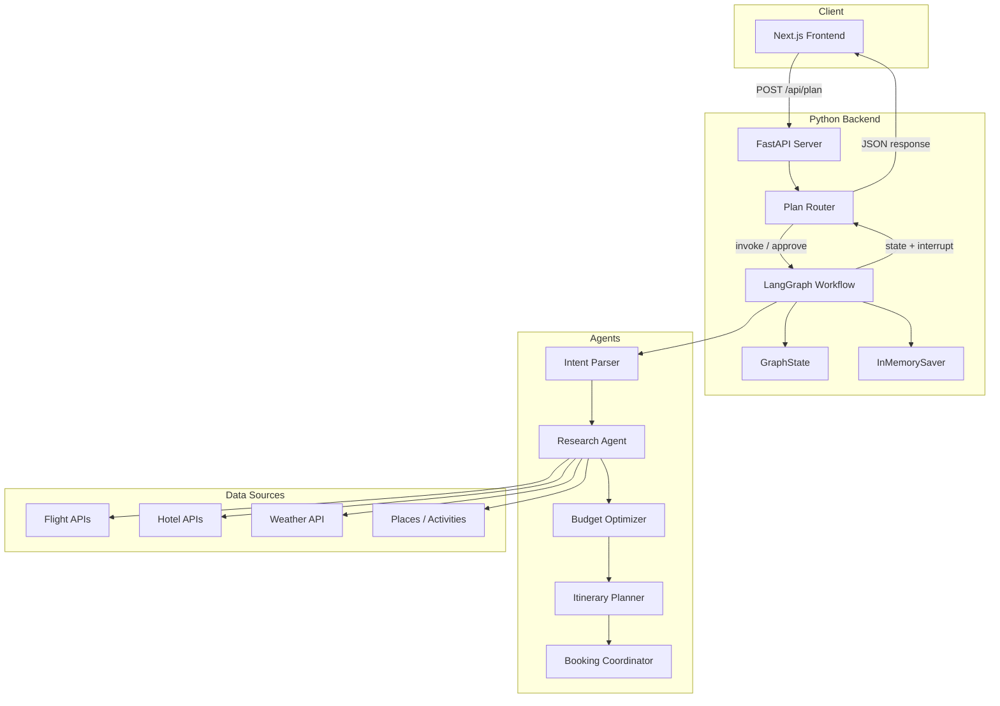
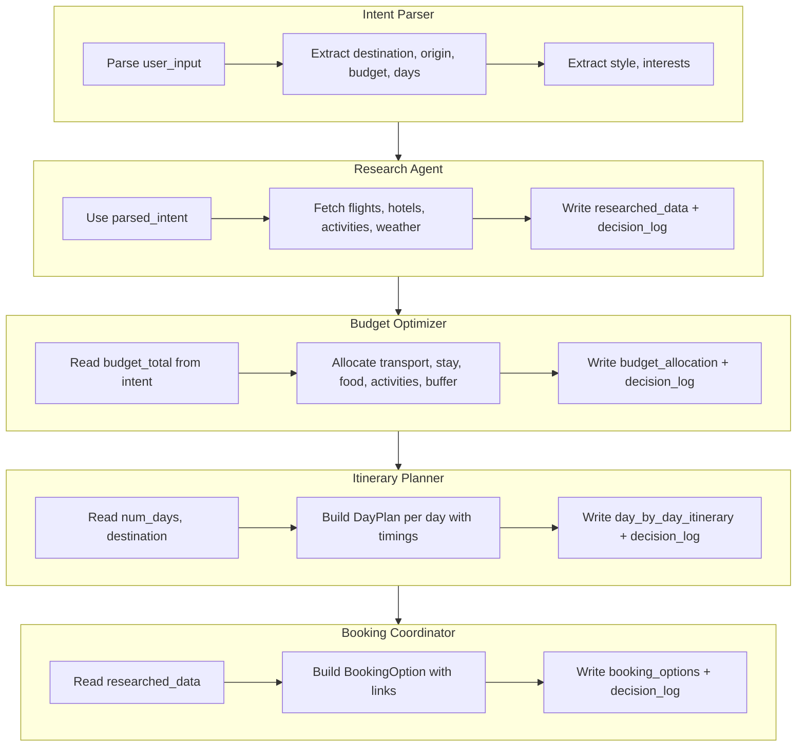
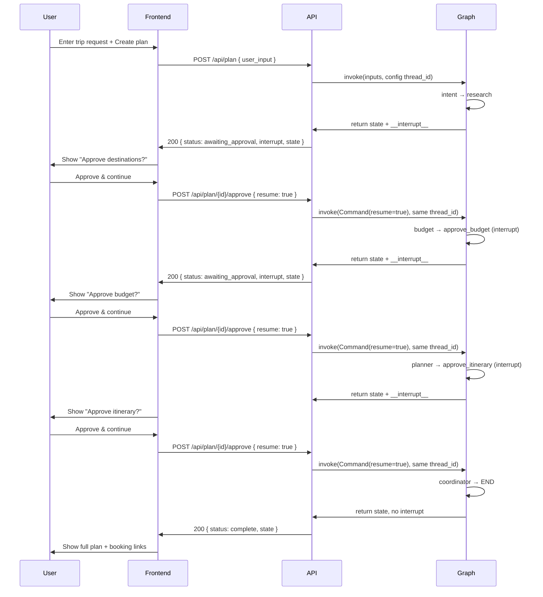
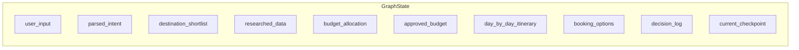

# AI Travel Planning & Booking Agent – Backend Architecture

## 1. High-level system overview



- **FastAPI** exposes `/api/plan` (create) and `/api/plan/{thread_id}/approve` (resume).
- **LangGraph** runs the workflow; **GraphState** holds all plan data; **InMemorySaver** persists state for human-in-the-loop.
- **Agents** read/write state; **Research** can call external **Data sources** (currently demo data).

---

## 2. Workflow orchestration (node flow)

```mermaid
flowchart LR
  START([Start]) --> Intent
  Intent --> Research
  Research --> ApproveDest[Approve Destinations]
  ApproveDest -->|"interrupt → resume"| Budget
  Budget --> ApproveBudget[Approve Budget]
  ApproveBudget -->|"interrupt → resume"| Planner
  Planner --> ApproveItin[Approve Itinerary]
  ApproveItin -->|"interrupt → resume"| Coordinator
  Coordinator --> END([End])
```



| Step | Node | Role |
|------|------|------|
| 1 | **intent** | Parse `user_input` → `parsed_intent`, `destination_shortlist` |
| 2 | **research** | Fetch flights, hotels, activities, weather → `researched_data` |
| 3 | **approve_destinations** | **Interrupt** – user approves destination shortlist |
| 4 | **budget** | Allocate budget → `budget_allocation` |
| 5 | **approve_budget** | **Interrupt** – user approves or edits budget |
| 6 | **planner** | Build day-by-day itinerary → `day_by_day_itinerary` |
| 7 | **approve_itinerary** | **Interrupt** – user approves final itinerary |
| 8 | **coordinator** | Build booking-ready options → `booking_options` |

All edges are sequential; the three **approve** nodes call `interrupt()` so the graph pauses until the client sends a resume (e.g. `POST .../approve` with `resume: true`).

---

## 3. Agent roles and responsibilities



| Agent | Inputs | Outputs |
|-------|--------|--------|
| **Intent Parser** | `user_input` | `parsed_intent`, `destination_shortlist`, `decision_log` |
| **Research** | `parsed_intent` | `researched_data` (flights, hotels, activities, weather, tips), `decision_log` |
| **Budget Optimizer** | `parsed_intent` | `budget_allocation`, `decision_log` |
| **Planner** | `parsed_intent`, `researched_data` | `day_by_day_itinerary`, `decision_log` |
| **Booking Coordinator** | `researched_data` | `booking_options`, `decision_log` |

---

## 4. Human-in-the-loop integration



- **Checkpoints**: (1) destination shortlist, (2) budget allocation, (3) final itinerary.
- **Resume**: Same `thread_id` + `Command(resume=...)` so the graph continues from the interrupt.
- **Checkpointer**: InMemorySaver stores state per `thread_id` so resume has full context.

---

## 5. State schema (GraphState)



- **user_input**: Raw string from the user.
- **parsed_intent**: ParsedIntent (budget_total, currency, origin, destination, num_days, travel_style, interests).
- **researched_data**: ResearchedData (flights[], hotels[], activities[], weather[], local_tips).
- **budget_allocation** / **approved_budget**: BudgetAllocation (transport, stay, food, activities, buffer, reasoning).
- **day_by_day_itinerary**: DayPlan[] (day, date, items[] with time, title, duration, price, links).
- **booking_options**: BookingOption[] (type, label, booking_link, map_link, price).
- **decision_log**: DecisionLogEntry[] (agent, step, message) for transparency.

---

## 6. API surface

| Method | Path | Purpose |
|--------|------|--------|
| POST | `/api/plan` | Create plan: body `{ user_input }` → runs graph; returns `thread_id`, `status`, `state`, optional `interrupt` |
| POST | `/api/plan/{thread_id}/approve` | Resume: body `{ resume: true }` or `{ resume: <modified_budget> }` → continues graph |
| GET | `/api/plan/{thread_id}` | Get current state for a thread (e.g. reload page) |
| GET | `/health` | Health check |

---

## 7. File layout (backend)

```
backend/
├── main.py           # FastAPI app, CORS, lifespan
├── graph.py          # LangGraph definition, nodes, edges, interrupts, checkpointer
├── state.py          # GraphState, Pydantic models (ParsedIntent, ResearchedData, etc.)
├── routes.py         # POST /api/plan, POST /api/plan/{id}/approve, GET /api/plan/{id}
├── agents/
│   ├── intent.py     # parse_intent (regex + keywords)
│   ├── research.py   # research (demo data; pluggable APIs)
│   ├── budget.py     # optimize_budget
│   ├── planner.py    # plan_itinerary
│   └── coordinator.py # coordinate_bookings
└── requirements.txt
```

This document describes the LLM/backend architecture for the AI Travel Planning & Booking Agent.
