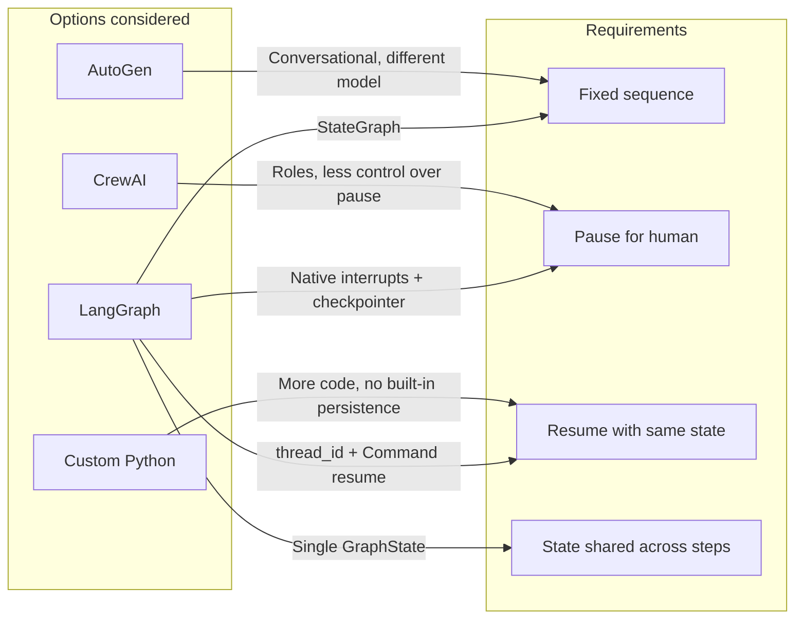
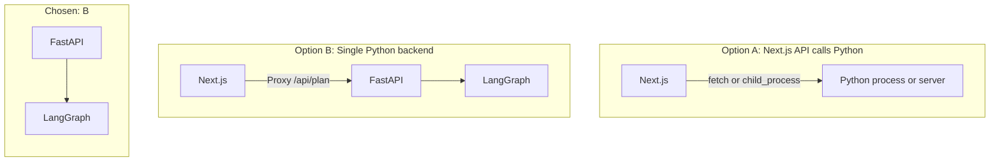
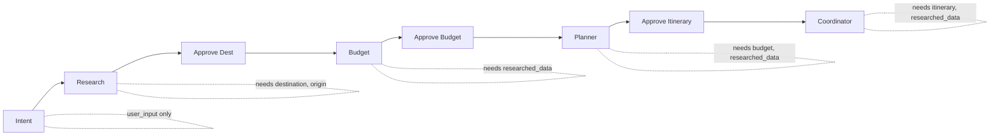
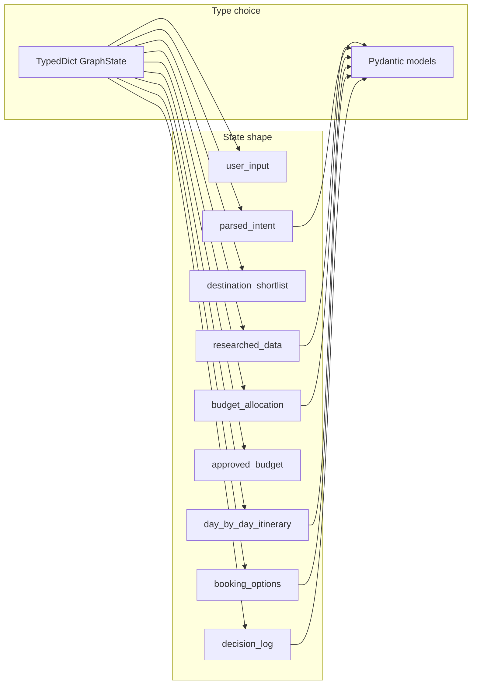
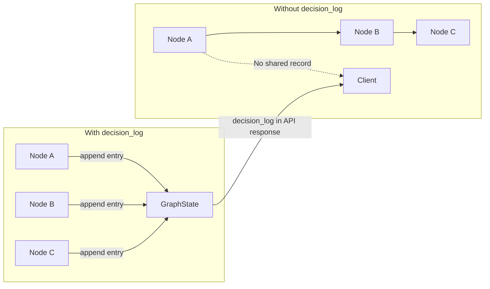
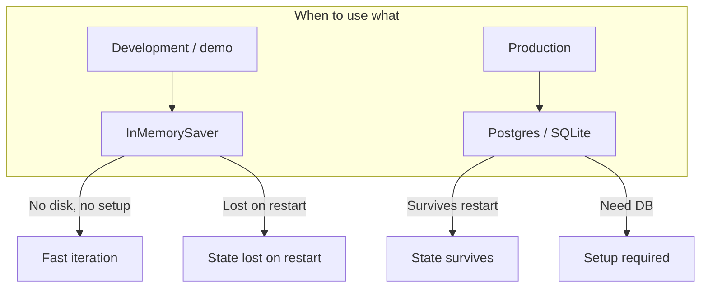
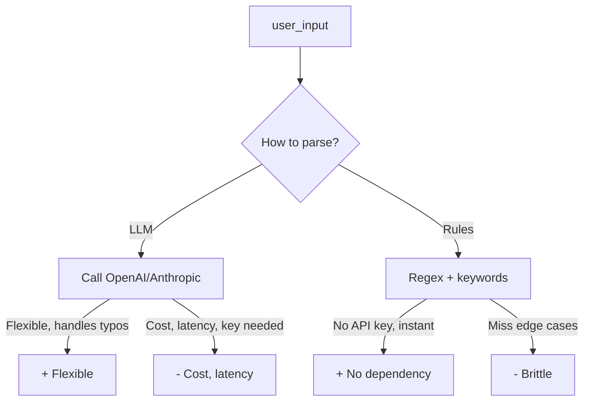
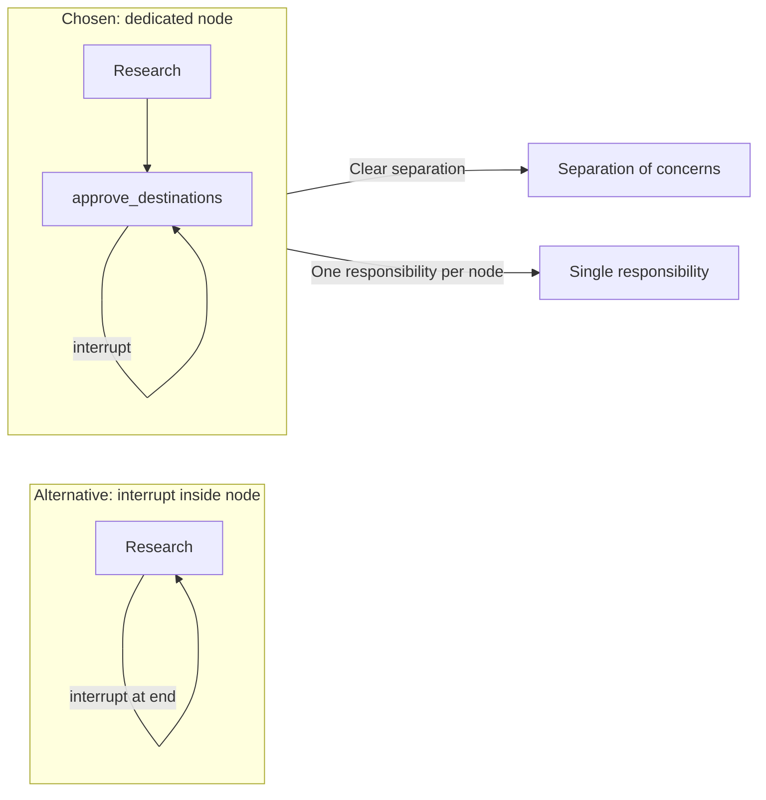
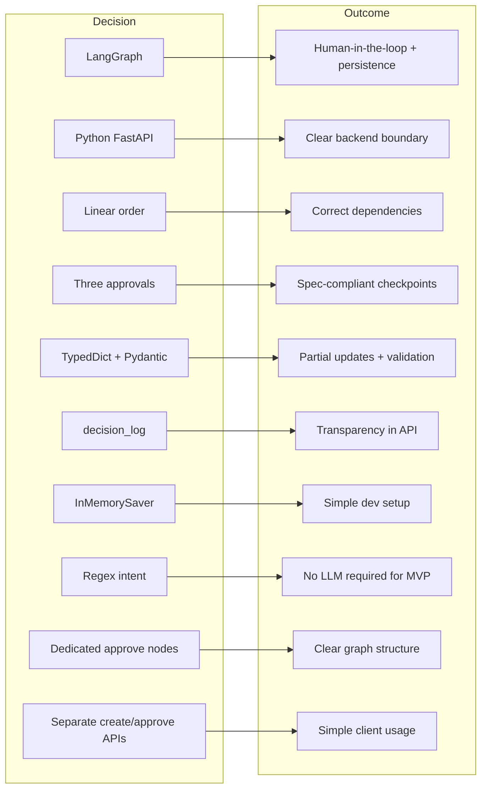

# LLM Backend – Design Decisions

This document explains **why** each major decision was made in the travel-planning LLM backend. Diagrams are used to compare options and show the reasoning flow.

---

## 1. Why LangGraph for orchestration?

We needed a way to run multiple “agents” (intent, research, budget, planner, coordinator) in a fixed order and **pause for human approval** at specific steps. The choice was between a general-purpose orchestration framework and a custom pipeline.

**Decision: LangGraph**

| Criterion | LangGraph | CrewAI | AutoGen | Custom |
|-----------|-----------|--------|---------|--------|
| Human-in-the-loop | **`interrupt()` + Command(resume)** | Manual wiring | Conversation-based | Build yourself |
| State persistence | **Checkpointer (memory/DB)** | Less standard | Per-agent | Manual |
| Deterministic order | **Explicit edges** | Task order | Less clear | Full control |
| Learning curve | Medium | Low | Medium | Low |

**Rationale:** The hackathon required **three approval checkpoints** (destination shortlist, budget, final itinerary). LangGraph’s `interrupt()` plus checkpointer gives “pause, return payload to client, resume later with same state” without custom queues or storage. The graph is a **linear state machine**, which matches “plan once, approve at fixed steps.”

---

## 2. Why Python + FastAPI (separate from Next.js)?

The frontend is Next.js (TypeScript). The agent stack is Python (LangChain/LangGraph, optional LLM SDKs). We could run agents inside Next.js via a subprocess or a separate service.

**Decision: Separate Python backend (FastAPI)**

- **Python:** LangGraph and most LLM/agent libraries are Python-first. Keeping all agent logic in Python avoids reimplementing or bridging from Node.
- **FastAPI:** Simple HTTP API, async, automatic OpenAPI docs. One service owns “run graph” and “resume graph”; Next.js only proxies and renders.
- **No agents in Next.js:** Would require either running Python as a subprocess (operationally messy) or reimplementing the graph in JS (duplication, fewer libraries).

**Result:** Backend = FastAPI + LangGraph. Frontend calls Next.js `/api/plan`, which proxies to `BACKEND_URL` (FastAPI). All agent state and API keys stay in the Python process.

---

## 3. Why this node order (intent → research → budget → planner → coordinator)?

The workflow is strictly linear. Order was chosen so each step has the inputs it needs and approvals happen at meaningful moments.

**Dependency flow:**

| Step | Needs from state | Produces |
|------|------------------|----------|
| Intent | `user_input` | `parsed_intent`, `destination_shortlist` |
| Research | `parsed_intent` (destination, origin) | `researched_data` |
| Budget | `parsed_intent` (budget_total), `researched_data` (for realism) | `budget_allocation` |
| Planner | `parsed_intent` (num_days), `researched_data`, `approved_budget` | `day_by_day_itinerary` |
| Coordinator | `researched_data`, `day_by_day_itinerary` | `booking_options` |

**Why not parallel?** Research could theoretically fetch flights and hotels in parallel *inside* the research node, but the **sequence** of steps (intent before research, research before budget, etc.) is fixed. Parallelizing **nodes** would break dependencies (e.g. planner needs budget output).

**Decision:** Linear graph with this order so dependencies are satisfied and approvals occur after “what to book” (destinations), “how much to spend” (budget), and “what the trip looks like” (itinerary).

---

## 4. Why three approval checkpoints (and where)?

The spec asked for human-in-the-loop at “destination shortlist, budget allocation, final itinerary.” We map that to three nodes that call `interrupt()`.

```mermaid
flowchart TB
  subgraph no_approval [If we had no approvals]
    I1[Intent] --> R1[Research] --> B1[Budget] --> P1[Planner] --> C1[Coordinator]
    C1 --> Out1[Full result]
  end

  subgraph with_approval [Actual design]
    I2[Intent] --> R2[Research]
    R2 --> AD[Approve Destinations]
    AD -->|"User sees shortlist + research summary"| B2[Budget]
    B2 --> AB[Approve Budget]
    AB -->|"User sees allocation"| P2[Planner]
    P2 --> AI[Approve Itinerary]
    AI -->|"User sees day-by-day plan"| C2[Coordinator]
    C2 --> Out2[Booking options]
  end
```

**Why after research (destination)?**  
So the user can confirm “we’re planning for these places” and see a short research summary (e.g. flight/hotel counts) before money is allocated.

**Why after budget?**  
So the user can accept or adjust the split (transport, stay, food, activities). The planner then uses `approved_budget` (or the user’s edited values) to build the itinerary.

**Why after planner (itinerary)?**  
So the user can approve the final day-by-day plan before we produce booking links. Avoids generating links for a plan the user might reject.

**Decision:** Exactly three interrupt nodes—`approve_destinations`, `approve_budget`, `approve_itinerary`—placed so each approval has the right context and the next step uses the approved data.

---

## 5. Why TypedDict + Pydantic for state?

LangGraph needs a single state object that nodes read and update. We use a **TypedDict** for the graph and **Pydantic** for nested structures.

**Why TypedDict for the top-level state?**

- LangGraph supports **partial updates**: a node returns only the keys it changes. TypedDict with `total=False` fits that (optional keys).
- We need a **reducer** for `decision_log` (append). LangGraph allows `Annotated[list, operator.add]` so each node can return `{"decision_log": [new_entry]}` and the list is merged.

**Why Pydantic for nested values?**

- `ParsedIntent`, `ResearchedData`, `BudgetAllocation`, `DayPlan`, `BookingOption`, `DecisionLogEntry` need validation and serialization (for API responses and for interrupt payloads). Pydantic gives that and a single `.model_dump()` for JSON.

**Decision:** GraphState = TypedDict with optional keys and `decision_log: Annotated[list, operator.add]`. All nested data = Pydantic models so we can validate and serialize consistently.

---

## 6. Why a dedicated “decision log” in state?

The spec asked for **transparency**: show agent reasoning and research process. We could either stream messages to the client or accumulate a log in state.

**Decision: `decision_log` in state**

- Each node appends one or more `DecisionLogEntry` (agent name, step, message, optional data).
- The client receives full state (including `decision_log`) on every response, so the UI can show “why this hotel,” “why this allocation,” etc.
- No extra streaming or side channel: transparency is part of the same state that drives the workflow.

---

## 7. Why InMemorySaver for the checkpointer?

LangGraph needs a checkpointer to save state at interrupts and restore it on resume. Options: in-memory, SQLite, Postgres.

**Decision: InMemorySaver for now**

- Fits **development and demos**: no DB setup, same process.
- **Trade-off:** State is lost when the backend restarts. For production we’d switch to a persistent checkpointer (e.g. LangGraph’s Postgres or SQLite adapter) so plans survive restarts and multiple instances can share state.

---

## 8. Why regex/keyword intent parser (no LLM)?

Intent parsing could be done with an LLM (“extract destination, budget, days from this text”) or with rules (regex, keywords).

**Decision: Regex and keyword extraction first**

- **Hackathon/demo:** Works without an API key; no extra latency or cost.
- **Deterministic:** Same input → same parsed intent, which helps debugging and testing.
- **Upgrade path:** The intent node can be replaced later with an LLM call that returns the same `ParsedIntent` shape; the rest of the graph stays unchanged.

So the **decision** is “structured output (ParsedIntent) with a rule-based implementation first, LLM later if needed.”

---

## 9. Why separate “approve” nodes instead of inline interrupts?

We could have called `interrupt()` inside the research, budget, or planner nodes. We use **dedicated nodes** (e.g. `approve_destinations`) instead.

**Decision: Dedicated approval nodes**

- **Single responsibility:** Research only researches; “approve destinations” only interrupts and returns. Easier to read and test.
- **Reuse:** Same pattern for all three checkpoints (payload → interrupt → on resume, return update and continue).
- **Explicit graph:** The graph shows “research → approve_destinations → budget,” so it’s obvious where the pause is.

---

## 10. Summary: decision → outcome

Together, these decisions give a backend that: runs a linear, human-in-the-loop travel plan in Python with LangGraph; keeps state in a single TypedDict with Pydantic models; exposes create/approve/read via FastAPI; and stays transparent and easy to extend (e.g. swap intent to LLM, add a persistent checkpointer).
